# Restaurant Kitchen Service

## Check it out!

[Restaurant kitchen service project deployed to Render](https://restaurant-kitchen-service-0u9l.onrender.com/)

## Login info:

- **Username:** lu
- **Password:** 6hH00kkhY}t

## Project Description

Restaurant Kitchen Service is a web-based application designed to streamline and manage the operations of a restaurant kitchen. The primary goal is to improve communication within the kitchen, reduce order processing time, and minimize errors.

## Technologies Used

- **Backend:** Python, Django
- **Frontend:** HTML, CSS, JavaScript, Bootstrap
- **Database:** Sqlite
- **Version Control:** Git

## DB Schema

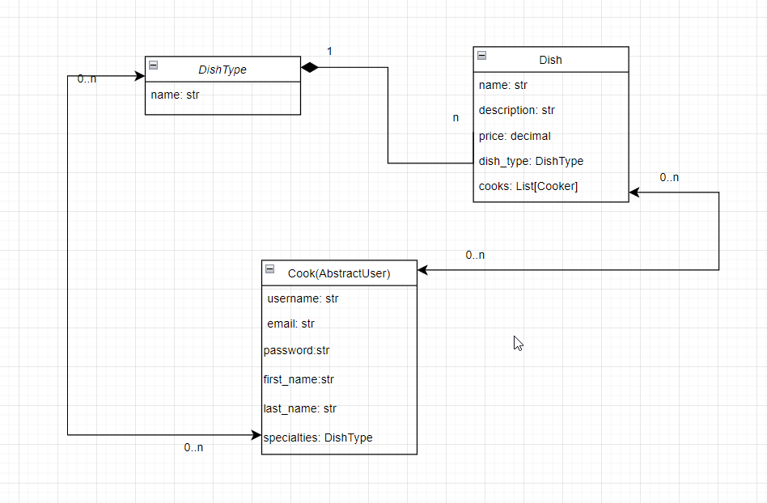

## Installation Instructions

### Prerequisites

- Python 3.8+
- Sqlite
- Django

### Step-by-Step Guide

1. **Clone the repository:**
   ```bash
   git clone https://github.com/RomanDanyl/restaurant_kitchen_service
   cd restaurant_kitchen_service

2. **Create and activate a virtual environment:**
    ```
    python -m venv venv
    source venv/bin/activate  # On Windows use `venv\Scripts\activate`
    
3. **Install dependencies:**

    ```
    pip install -r requirements.txt
    
4. **Configure the database:**
    ```
    python manage.py migrate
    python manage.py makemigrations

5. **Create a superuser:**
    ```
    python manage.py createsuperuser

6. **Run the development server:**
    ```
    python manage.py runserver

7. **Access the application:**
Open your browser and navigate to http://127.0.0.1:8000/.

## Screenshots:
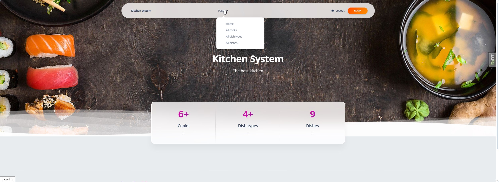

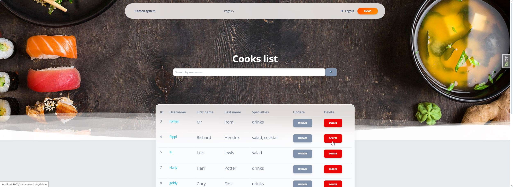

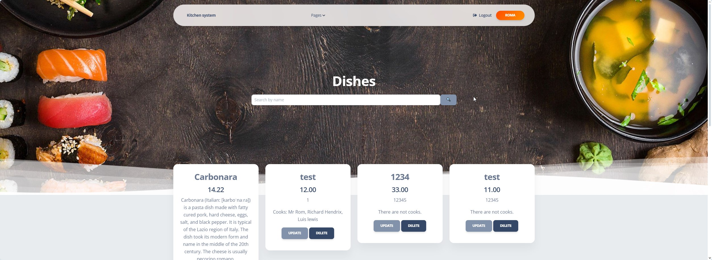

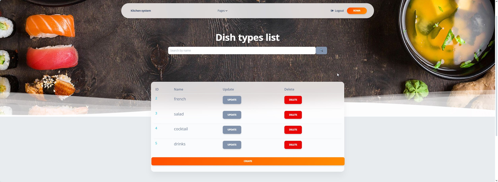

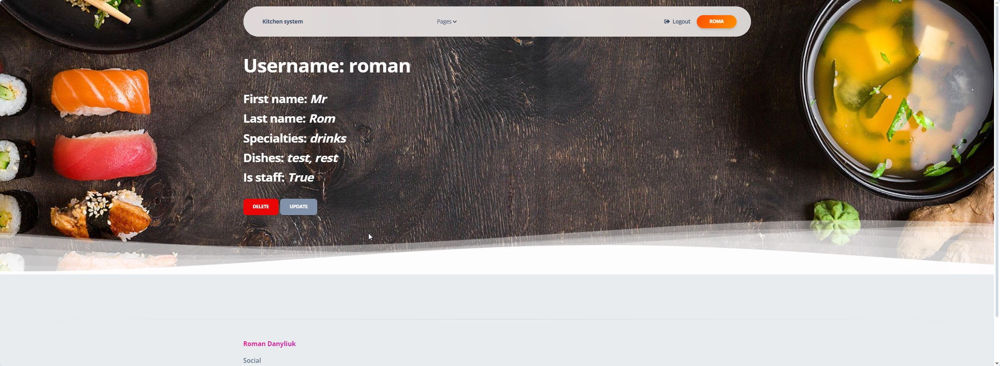

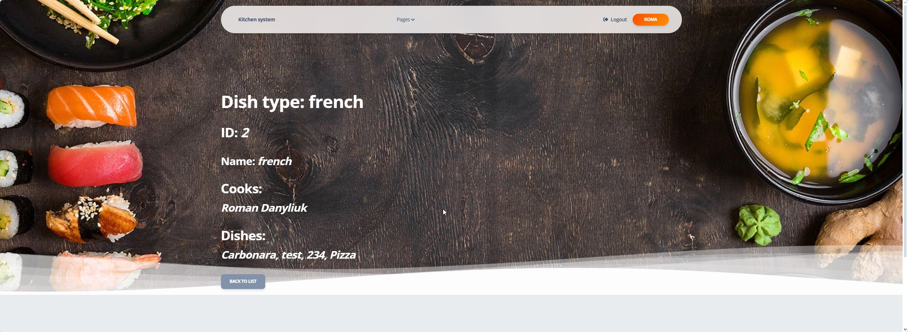

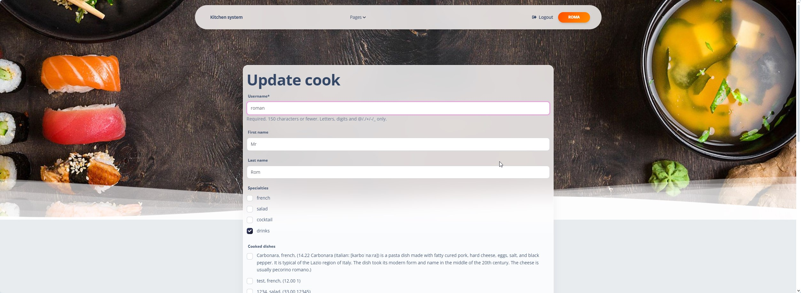

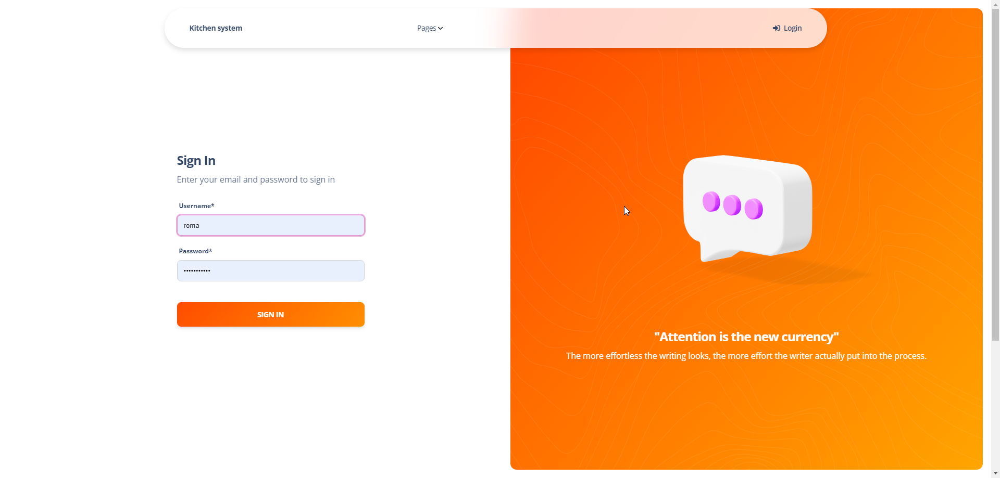

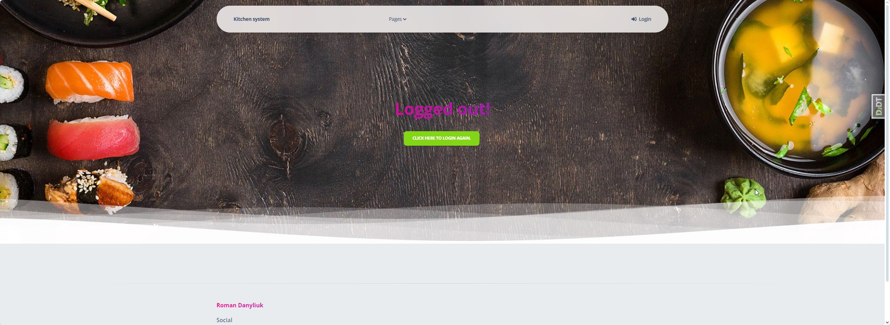

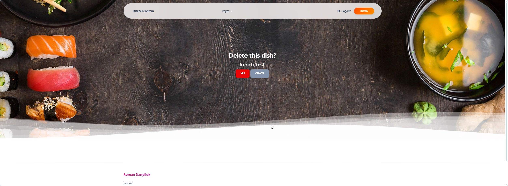